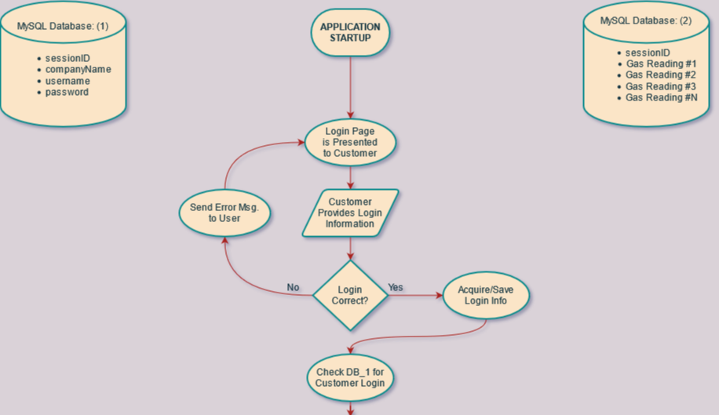
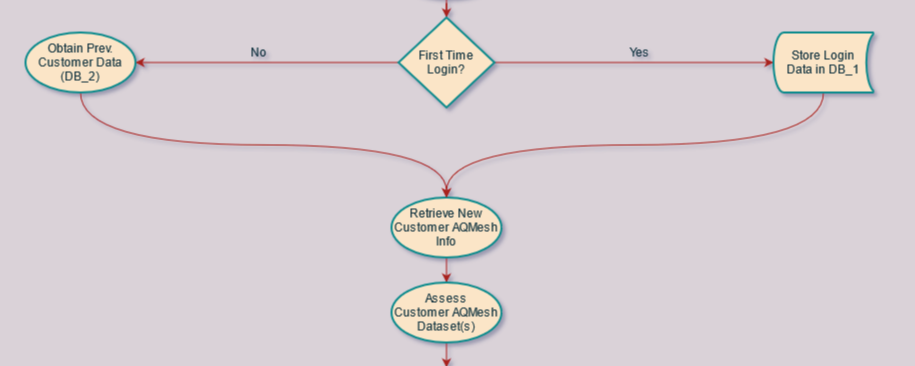
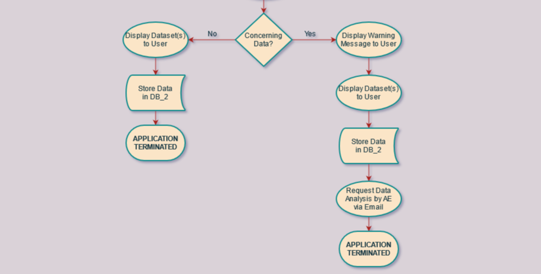

# aqmesh-server-app

## Overview

### What is This?
A web application that uses multiple resources (AQMesh API, MySQL, etc.) in order to track customer data.

### Server/Data Flow

#### Startup/Login
Upon reaching the login page on startup, a user will be prompted to enter their AQMesh account
information in order to identify their data and instrumentation. The first two fields are currently
required to have filled out before beginning a search query.



There is currently no limit as to how many times a user can attempt to log in on the application. Once
enough correct information is given and/or registered, it is time to move on to the Recurring User Check.

#### First Data Queries (Recurring User/Data Check)
Our first data query that is used by the application (other than registering a user to the app) is used
to ensure the prevention of duplicated data and other similar complications.



Assuming that our Recurring User check comes back without failing or triggering an error, we can assume that
the user has not yet registered with the app. That being said, we won't have any previously queried data to use
in data analyses, but we can store the current session's data for next time.

#### Mini Data Analysis
The final step is to compare the values in the current collected data with both previously collected data and
min/max threshold values. Doing this will enable us to contact and notify users when the data being read on their
instruments is alarming for whatever reason.



If no alarming data is found, the data is stored in the instrumentation's readings database ('DB_2'), ready to be used for
comparisons/analyses in future logins

### Resources
* NodeJS
  * Runs application on a web server (currently localhost:1337)
* MySQL
  * Stores/Retrieves customer data upon request by web application (currently running on URI cPanel account)
* AQMesh API
  * Allows for the retrieval of air quality data from AQMesh intruments/servers

## Manual Operation & Debugging
1. Run terminal application
  - Make sure NodeJS is installed on your terminal application before proceeding to Step 2.
2. Navigate to aqmesh-server-app directory and run the application with the following command:

```bash
node server.js
```

3. Navigate to 'localhost:1337/' on your internet browser and begin adding/searching for clients.

