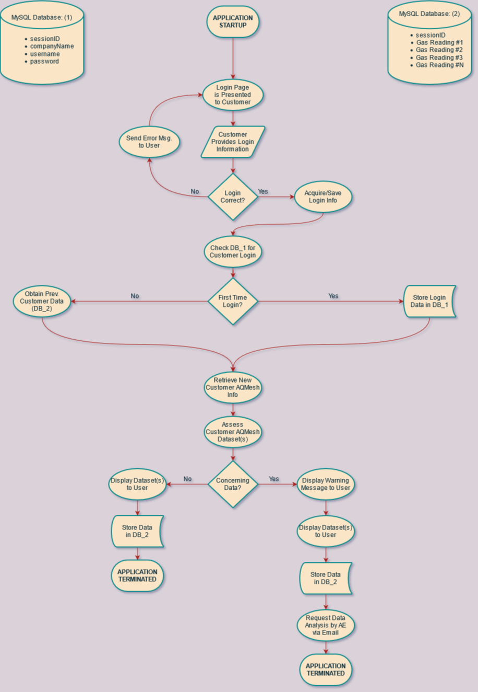

# aqmesh-server-app

## Overview

### What is This?
A web application that uses multiple resources (AQMesh API, MySQL, etc.) in order to track customer data.

### Work Flow Visualization


### Resources
* NodeJS
  * Runs application on a web server (currently localhost:1337/)
* MySQL
  * Stores/Retrieves customer data upon request by web application (currently running on URI cPanel account)
*AQMesh API
  * Allows for the retrieval of air quality data from AQMesh intruments/servers

## Manual Operation & Debugging
1. Run terminal application
  - Make sure NodeJS is installed on your terminal application before proceeding to Step 2.
2. Navigate to aqmesh-server-app directory and run the application with the following command:

```bash
node server.js
```

3. Navigate to 'localhost:1337/' on your internet browser and begin adding/searching for clients!

